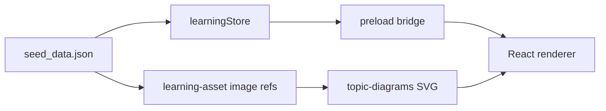

# 昇腾 AI Infra 内容质量升级方案

## 目标与边界

- 目标：把现有“概念说明型”内容升级为“专家级工程教材”，每个 Topic 都要讲清硬件约束、CANN/vLLM 落地点、容量或性能推导、真实工程案例、常见误区与排障线索。
- 范围：保留现有 4 Stage / 21 Topic 主体结构，优先改 [resources/seed_data.json](d:\AI项目\AI-Infra-Learning\resources\seed_data.json) 与 [resources/topic-diagrams](d:\AI项目\AI-Infra-Learning\resources\topic-diagrams)，轻量改造 [src/renderer/components/TopicDetailView.tsx](d:\AI项目\AI-Infra-Learning\src\renderer\components\TopicDetailView.tsx)、[src/renderer/components/MarkdownContent.tsx](d:\AI项目\AI-Infra-Learning\src\renderer\components\MarkdownContent.tsx)、[src/renderer/lib/markdown.ts](d:\AI项目\AI-Infra-Learning\src\renderer\lib\markdown.ts) 与样式。
- 不做：不引入考试模块、题库评分、内容编辑器、外链图床、远程内容加载，不放宽 Markdown XSS 与 Electron CSP 安全边界。

## 当前问题诊断

- 内容密度不稳定：部分 Topic 已有长文框架，但仍存在占位值、泛泛描述、缺少可复现案例和昇腾细节的问题，例如 910B 分级一类内容不能只停留在“资源池标签”。
- 专家读者缺少“推导过程”：KV Cache、P/D 分离、量化、MTP、多租户等 Topic 应该给出公式、约束、容量测算和指标取舍，而不是只给结论。
- 配图偏装饰化：当前每个 Topic 一张 SVG，但多数像封面卡片，缺少真实系统路径、数据流、瓶颈定位、决策树和算子/内存层级关系。
- 信息架构有重复风险：`body_md` 已经承载正文，但详情页仍在正文后重复展示 `why`、`key_points`、`real_world_connection`，高质量长文会显得啰嗦。
- 技术底座可复用：当前 Markdown 已支持标题、列表、引用、表格、代码块与白名单 SVG 图，适合先用内容规范解决大部分质量问题。

## 内容重写标准

每个 Topic 统一采用“专家级学习单元”模板，正文写入 `body_md`：

- 开篇抓手：一句话说明该知识点解决什么工程决策，避免抽象口号。
- 问题场景：给出一个真实 AI Infra 场景，例如长上下文压测、910B 资源池分配、vLLM-Ascend 调优、P/D 分离扩容、网关跨集群路由。
- 第一性原理：解释硬件、内存、带宽、互联、调度或模型结构背后的关键约束。
- 昇腾落地点：明确关联 910B、CANN、算子、ACL/torch-npu、vLLM Ascend、HCCL、NPU profiling、资源池策略等。
- 推导示例：至少给一个容量、吞吐、延迟、显存或成本测算，能让读者照着复盘。
- 工程案例：给出“症状 → 观察指标 → 判断 → 处理动作 → 验证结果”的闭环。
- 对比与边界：说明与 NVIDIA/CUDA 生态、Dense/MoE、Prefill/Decode、INT8/FP16/BF16 等选择的差异和适用条件。
- 误区清单：列出 3 到 5 个团队容易踩的坑。
- 自检问题：用 Markdown 写 2 到 3 个开放式问题，不做判题和评分，保持轻量边界。

## 21 个 Topic 的优化方向

- S1 第一性原理：把 `T01` 到 `T03`、`T19` 到 `T21` 改成“模型结构如何转化为硬件压力”的主线，重点补 Roofline 推导、KV Cache 公式、MoE 路由与专家并行、MHA/GQA/MLA/线性注意力的访存差异、Qwen/DeepSeek 混合架构对推理系统的影响。
- S2 昇腾硬件与推理引擎：把 `T04` 到 `T08` 做成昇腾落地核心模块，补 910B 分级依据、达芬奇架构与 Cube/Vector/Scalar 直觉、CANN 栈、torch-npu/vLLM Ascend 适配点、PagedAttention 在 NPU 上的瓶颈、P/D 分离和 4P4D 的容量规划。
- S3 推理优化与服务化：把 `T09` 到 `T14` 做成性能工程模块，补 MTP 投机收益模型、量化选型与硬件分层、TTFT/TPOT/E2E/P99 指标体系、路由决策、限流降级、可观测性与 profiling 链路。
- S4 平台与战略：把 `T15` 到 `T18` 做成平台治理模块，补多租户隔离、模型发布与回滚、MaaS 控制面/数据面、硬件代际规划与成本模型，避免只写平台愿景。

## 配图升级标准

- 每篇至少保留 1 张主图，复杂 Topic 可增加 1 到 2 张内文 SVG；所有图片继续走 `learning-asset://topic-diagrams/...svg`，不引入外链和位图。
- 主图从“标题卡”改成“解释图”：优先使用数据流图、瓶颈定位图、容量测算图、决策树、时序图、层级架构图。
- 每张图必须回答一个明确问题，例如“这个瓶颈在哪里发生”“这个指标由哪些变量决定”“这个架构为什么能降低 TTFT”。
- SVG 命名继续采用小写字母、数字和连字符；若允许多图，需要同步更新图片引用校验与测试，使测试验证“所有引用存在”而不是假设“每篇只有一张”。

## 轻量 UI 与 Markdown 能力

- 调整 `TopicDetailView` 信息架构：把 `why`、`key_points`、`real_world_connection` 作为顶部摘要卡或侧边摘要，避免在完整正文后重复展示。
- 增强 Markdown 阅读体验：优化标题层级、表格、代码块、图片 caption、blockquote/callout 的 CSS，不引入危险 HTML。
- 采用约定式 callout：例如 `> [!NOTE]`、`> [!WARNING]`、`> [!ASCEND]` 先用安全 Markdown/样式承载，不新增可执行内容。
- 如需多图，最小改动扩展图片资产测试与样式；保持 `learning-asset` 协议、DOMPurify、CSP 与路径白名单一致。

## 交付节奏

1. 内容审计：逐篇标注“占位、缺公式、缺昇腾细节、缺案例、配图不达标”的问题清单，形成 21 个 Topic 的改写 backlog。
2. 样板先行：优先重写 `T04`、`T05`、`T07`、`T08` 四篇，覆盖硬件、CANN、vLLM Ascend、P/D 分离四类核心表达。
3. 评审标准定稿：用样板校准深度、篇幅、图风格、术语、公式密度和读者门槛，再批量展开。
4. 批量重写：按 S1 → S2 → S3 → S4 分批改造，每批保持 seed、图片、测试同时可运行。
5. 轻量 UI 改造：在内容样板稳定后调整详情页布局与 Markdown 样式，避免先做 UI 后返工。
6. 专家复核：重点复核昇腾硬件参数、CANN/vLLM Ascend 术语、性能推导假设和内部场景是否准确。

## 验证方式

- 内容验证：检查每篇是否包含场景、原理、昇腾落点、推导、案例、误区、自检问题，且没有 `XXX`、`????`、泛化空话。
- 资产验证：所有 `learning-asset://topic-diagrams/*.svg` 引用必须存在，SVG 标题、描述和正文表达一致。
- 工程验证：涉及 seed、图片、Markdown 或 UI 后运行 `npm test`；涉及类型、IPC、主进程或安全边界后运行 `npm run typecheck`。
- 手工验证：Electron 实窗检查长文可读性、图是否清晰、表格和代码块是否溢出、暗色主题下是否易读。