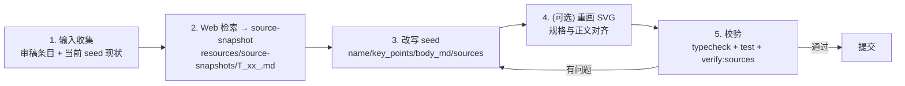

# Topic Source Rewrite Playbook

本 playbook 是"用权威来源消除 Topic 内容幻觉"的端到端 SOP。**任何 AI agent 拿到一个待修复的 Topic，都应严格按本文步骤跑一遍**，不要自由发挥。

T20 已经按本 playbook 走通端到端（产物见 [resources/source-snapshots/T20.md](resources/source-snapshots/T20.md)、[resources/seed_data.json](resources/seed_data.json) 中 T20 块、[resources/topic-diagrams/t20-qwen-deltanet.svg](resources/topic-diagrams/t20-qwen-deltanet.svg)）。后续 T03 / T16 / T19 / T02 / T10 等 Topic 完全照本文流程走即可。

---

## 0. 前提：必须先做的环境校验

进入仓库后第一时间确认基础设施是好的，不要直接动 seed：

```bash
npm install                                # 仅首次
npm run typecheck                          # 应通过
npm test                                   # 应 46/46 全过（基线）
npm run verify:sources -- --no-urls        # 应仅报警当前未修复的存量幻觉
```

如果上面任何一步 FAIL，**先停下，把基线修绿再开始改 Topic**——否则你后面无法判断是自己改坏的还是原本就坏。

务必先读一遍以保持上下文：

- [CLAUDE.md](CLAUDE.md)：项目级 agent 约束（架构边界、Electron 安全基线、Markdown XSS 防线）
- [审稿结果1.md](审稿结果1.md) + [审稿结果2.md](审稿结果2.md)：所有待修复幻觉的 backlog
- [resources/source-snapshots/T20.md](resources/source-snapshots/T20.md)：参考样板
- [scripts/known-models.json](scripts/known-models.json)：当前已确认存在的官方模型白名单

---

## 1. 总体工作流（5 步）



**铁律**：**没写完 source-snapshot 之前，不准动 seed 的任何具体数字**。这是防止你（agent）自己又造新幻觉的唯一可靠机制。

---

## 2. 步骤详解

### 步骤 1：输入收集

对每个目标 Topic，从下面三处把信息聚合到一处：

1. **审稿报告**：在 [审稿结果1.md](审稿结果1.md) 和 [审稿结果2.md](审稿结果2.md) 里搜 `T<id>`（如 `T03`），把所有相关条目和"建议修改"摘出来
2. **当前 seed 状态**：用 Read 打开 [resources/seed_data.json](resources/seed_data.json)，找到 `"id": "T<id>"` 块，**完整读完**该 Topic 的 `name / key_points / real_world_connection / body_md / sources` 全部字段
3. **verify:sources 当前报警**：

```bash
npm run verify:sources -- --no-urls
```

把扫描输出里这个 Topic 的 `[SUSPICIOUS]` 行记下来——这些是必须替换或者用 `[!ASSUMPTION]` 标注的具体型号名。

完成本步骤的标志：你能用一句话说清楚"这个 Topic 当前哪些断言无来源、需要替换成什么"。

---

### 步骤 2：Web 检索 → 写 source-snapshot

**这一步是整个流程的关键防线**。绝对不要跳过、绝对不要把"我记忆中的事实"当作 source。

#### 2.1 检索方法

针对步骤 1 里需要替换/验证的每条断言（型号名、层数、规格、性能数字），用以下顺序检索：

1. **WebSearch** 搜关键词，找到一手来源 URL（优先级：HuggingFace 模型卡 > 官方技术报告 / arXiv 论文 > 官方 GitHub > 官方博客 > vLLM/SGLang 等推理框架的官方 issue/PR > 高质量第三方分析）
2. **WebFetch** 把找到的一手页面抓下来，从中提取**精确数字和原文措辞**
3. 如果检索不到一手来源，**该断言必须用 `[!ASSUMPTION]` 标注**，不要硬填一个数字

#### 2.2 source-snapshot 文件模板

新建 `resources/source-snapshots/T<id>.md`，严格按以下结构（直接抄并填空）：

```markdown
# T<id> 可验证事实清单（Source Snapshot）

> 本文是为 Topic T<id>「<Topic 名>」做的离线证据档案。
> 用途：所有改写 T<id> 正文/SVG 时引用的具体规格必须能在本文找到对应来源摘录；找不到的只能用定性表述或 `[!ASSUMPTION]` callout 标注为示例。
> 抓取日期：YYYY-MM-DD（写作时刻）。

---

## 1. 已确认存在的官方型号 / 数字 / 规格清单

<把每条 web 抓到的事实分小节列出，含具体数字和一手来源 URL>

### 1.1 <主题，比如 Qwen3 Dense 系列>

| 型号 | 关键规格 1 | 关键规格 2 | ... |
|---|---|---|---|
| ... | ... | ... | ... |

来源：
- <https://huggingface.co/...>
- <https://arxiv.org/abs/...>

---

## 2. 现有 seed 中的幻觉 / 不可验证规格清单

| 当前 seed 写法 | 实际情况 | 处理建议 |
|---|---|---|
| `<seed 里的原文>` | <web 检索的真相> | 替换为 `<新写法>` 或 `[!ASSUMPTION]` 标注 |
| ... | ... | ... |

---

## 3. 改写时的官方来源映射（直接复制到 seed 的 sources 数组）

### Source 1: <来源标题>

\`\`\`json
{
  "id": "<kebab-case-slug>",
  "title": "<可读标题>",
  "url": "<https URL>",
  "publisher": "<Hugging Face | arXiv | vLLM Project | Qwen Team | Huawei Ascend | DeepSeek | ...>",
  "last_verified": "YYYY-MM-DD",
  "confidence": "high|medium|low",
  "covers": [
    "<本来源支撑的具体断言 1>",
    "<本来源支撑的具体断言 2>"
  ]
}
\`\`\`

<重复 3-6 个 source>

---

## 4. 教学性比喻 / 假设性数字（必须用 [!ASSUMPTION] 或 [!INTERNAL] 标注）

- "<比喻文字>" — 教学比喻，正文保留无需标注
- "<没有官方来源的数字或部署假设>" — 必须用 `[!ASSUMPTION]` 标注
- "<GTS 内部经验或观察>" — 必须用 `[!INTERNAL]` 标注

---

## 5. 抓取方法与可复现性

抓取关键词：<列出实际用过的 WebSearch query>
抓取日期：YYYY-MM-DD
未来重审检查项：<列 2-3 条，比如官方 release notes 是否有更新>
```

完成本步骤的标志：snapshot 文件里**每个具体数字都有一个一手 URL 与之对应**；snapshot 通读一遍能回答"这个 Topic 该写什么、不该写什么"。

---

### 步骤 3：改写 seed

打开 [resources/seed_data.json](resources/seed_data.json)，定位到 `"id": "T<id>"` 块。按下面的子步骤改：

#### 3.1 字段改写规则

| 字段 | 怎么改 |
|---|---|
| `name` | 如型号名错误（如 "Qwen3.5-35B-A3B" → "Qwen3-30B-A3B"），把名字里的型号也改正 |
| `why` | 如包含错误型号同步改；不要新增无来源断言 |
| `key_points` | 每条只能保留 snapshot 里有 source 的具体数字，否则改成定性表述（"约 / 数十层级 / 显著低于"） |
| `real_world_connection` | **重灾区**——审稿报告很多 H 级问题都在这里。把 "已经在 GTS 现网把 X 提到 Y" 这类断言改成 "理论上限 / 需要按本地流量实测" |
| `body_md` | 同时引入 callout：详见 3.2 |
| `sources` | **新增**该字段，把 snapshot 第 3 节的 JSON 直接粘进来 |

#### 3.2 三种 callout 用法（已支持）

| Callout | 渲染颜色 | 何时使用 |
|---|---|---|
| `> [!FACT]` | 绿 | 该段所有具体数字都有 sources 数组里的一手 URL 背书；强烈建议在段尾或下一段开头注明"来源：xx 模型卡"等 |
| `> [!ASSUMPTION]` | 黄 | 该段是教学示例数字、上限估计、未公开模型/未发布版本的假设规格 |
| `> [!INTERNAL]` | 灰 | GTS 内部经验、内部部署观察、私有评测——明确告诉读者这不在官方文档里 |
| `> [!ASCEND]` | 浅青 | 昇腾落地的工程提示（已存在，不变） |

**例子**（T20 实战）：

```markdown
## 机制拆解

> [!FACT]
> 来源：Qwen3-Next-80B-A3B-Instruct 官方模型卡（Hugging Face / Qwen Team）。
> Qwen3-Next-80B-A3B 共 48 层，按 12 × (3 个 Gated DeltaNet → MoE + 1 个 Gated Attention → MoE) 排布……

## 公式/判断

> [!FACT]
> Qwen 团队在 Qwen3-Next 公开页声明：处理 32K+ 上下文时，Qwen3-Next-80B-A3B
> 的推理吞吐相对 Qwen3-32B 高 10× 以上。该数字绑定他们的实验设定，平台引入前
> 必须按本地流量画像和 Ascend 后端实测。

## 放到 GTS 场景

> [!INTERNAL]
> Qwen3-Next 这类混合 attention + 高稀疏 MoE 模型对 GTS 的吸引力在于"长上下文 + agent 循环"
> 的成本结构更友好……本节为 GTS 内部经验，未在 Qwen 官方文档中体现。
```

#### 3.3 sources 数组结构（必须严格匹配类型）

类型见 [src/shared/types.ts](src/shared/types.ts) 的 `TopicSource`：

```ts
{
  id: string;                                  // kebab-case
  title: string;
  url: string;                                 // 必须 https:// 开头
  publisher: string;
  last_verified: string;                       // YYYY-MM-DD
  confidence: 'high' | 'medium' | 'low';
  covers: string[];                            // 至少 1 项
}
```

**注意 JSON 转义**：`body_md` 里的换行必须是字面 `\n`，反斜杠必须是 `\\`，引号必须是 `\"`。如果你不确定，**改完后立刻跑** `node -e "JSON.parse(require('fs').readFileSync('resources/seed_data.json','utf8'))"`，PARSE 失败就立即修。

#### 3.4 同步更新 known-models.json

如果 Topic 引入了新的官方型号（snapshot 里 verify 过的），把它加进 [scripts/known-models.json](scripts/known-models.json) 的 `models` 数组——否则 verify:sources 会把它标成 SUSPICIOUS。

格式：

```json
{
  "name": "<和 seed 里出现的字面写法完全一致>",
  "publisher": "<Qwen Team | DeepSeek | Mistral AI | ...>",
  "official_url": "<HuggingFace 或官方 GitHub 的一手 URL>"
}
```

**注意：模型名的变体（如 `Qwen3-Next-80B-A3B-Instruct` 和 `Qwen3-Next-80B-A3B-Thinking`）需要分别加，因为 verify:sources 是按字面匹配。**

---

### 步骤 4：重画 SVG（如有）

只有当步骤 3 的改动**改变了正文里写明的具体数字**（层数、块数、头数、显存量级）时才需要重画。

打开 `resources/topic-diagrams/t<id>-*.svg`，规则：

1. **标题/副标题必须与正文 key_points 一字不差**——这是审稿 H1 的核心问题
2. 如果实际规格太多（比如"48 层 = 12 块 × 4"），SVG 上画 4 块或 16 层都行，**但必须在标题或副标题里明确"图中只画 N 块作为示意，实际 ×M"**
3. 颜色编码与正文 callout 一致：FACT 元素用绿系（#34d399 / #6ee7b7）、INTERNAL 用灰系（#94a3b8 / #cbd5f5）、ASSUMPTION 用黄系（#fbbf24 / #fcd34d）
4. 字体保持 `Inter, Microsoft YaHei, Segoe UI, sans-serif` 的栈，避免渲染缺字

参考样板：[resources/topic-diagrams/t20-qwen-deltanet.svg](resources/topic-diagrams/t20-qwen-deltanet.svg)。

---

### 步骤 5：校验（必须全部通过才算完）

按下面顺序、严格按出错就回到步骤 3 的循环：

```bash
# 1. JSON 结构没坏
node -e "JSON.parse(require('fs').readFileSync('resources/seed_data.json','utf8'))"

# 2. TypeScript 通过
npm run typecheck

# 3. 全套单元测试通过（46/46）
npm test

# 4. verify:sources 仅扫模型名（看本 Topic 是不是已经全部 KNOWN）
npm run verify:sources -- --no-urls

# 5. verify:sources 带 URL 检查（仅本 Topic，省时间）
npm run verify:sources -- --topic T<id>
```

**绿灯标准**：

- 第 1 步：无 PARSE 错
- 第 2 步：无 TS 错
- 第 3 步：46/46 通过（不能少）
- 第 4 步：本 Topic 应只剩 `[KNOWN]` 行，不应再有 `[SUSPICIOUS]` 行
- 第 5 步：本 Topic 所有 URL `[OK 200]`，可疑模型 0

如果 verify:sources 在 URL 步骤里因为网络抖动 FAIL（`This operation was aborted` / `socket closed`），先重试 1-2 次；连续 3 次仍 FAIL 才动 URL（脚本已经做了 HEAD → GET fallback + UA header，正常情况下不应该网络问题导致 FAIL）。

---

## 3. 易踩的坑（基于 T20 实战）

### 坑 1：把"看起来合理"的型号当事实

`Qwen3.5-35B-A3B` 看上去完全像一个真实型号——版本号、总参/激活参格式都对，唯一的问题是**它根本不存在**。HF 上能搜到的是 `Qwen3-30B-A3B`。

**对策**：snapshot 步骤里，每个型号名你必须**真的去 HF 抓一次模型卡 URL**，能 200 才能写进 sources。任何"我记得 / 我推测"都不算。

### 坑 2：JSON 转义错误

body_md 是塞进 JSON 字符串的 markdown，特别容易错：

| 你想写的 | 必须写的 |
|---|---|
| 换行 | `\n` |
| `\` (反斜杠) | `\\` |
| `"` | `\"` |
| 中文标点（`，。：；""''`） | 直接写，不用转义 |

**对策**：每次 StrReplace 改完 body_md，立刻 `node -e "JSON.parse(...)"` 验一次，不要等到 npm test 才发现。

### 坑 3：把测试里 hardcode 的 Topic 名字漏改

如果你改了 `T<id>` 的 `name` 字段（比如 T20 从 "Gated DeltaNet混合架构：Qwen3.5/3.6的做法" 改成了新名字），但 [test/renderer.test.tsx](test/renderer.test.tsx) 里有 `screen.findByRole('heading', { name: '...' })` 在找老名字，测试会立即挂。

**对策**：改 `name` 字段后立刻 `rg "<旧 name>"` 全仓库搜，把所有命中改一遍。

### 坑 4：以为 styles.css / TopicDetailView 需要再加 sources UI

**不需要**。当前 [src/renderer/components/TopicDetailView.tsx](src/renderer/components/TopicDetailView.tsx) 已经有"可信来源" PanelCard，自动渲染 `topic.sources`。你只要把 sources 数组写进 seed，UI 端不用动一行代码。

### 坑 5：误以为某个文件被删了

git status 里 ` M file` 表示 modified（已存在但有改动），不是 deleted。`?? file` 才是 untracked。**永远先 Read 一次确认文件实际状态**，不要凭 git status 推测。

### 坑 6：在 PowerShell 里写带反引号的 node -e 一行命令

PowerShell 的反引号是转义字符，会把 JS 里的反引号吃掉。**有反引号的脚本一律落到文件再 node 跑**，不要 `node -e`。

### 坑 7：自动加 callout 的正则边界

`[!FACT]` / `[!ASSUMPTION]` / `[!INTERNAL]` 必须放在 blockquote 第一段的开头，紧跟 `>` 之后（参考 [src/renderer/lib/markdown.ts](src/renderer/lib/markdown.ts) 的 `CALLOUT_PATTERN`）。下面写法**不会被识别**：

```markdown
> 一些前置文字
> [!FACT]
> 内容
```

正确：

```markdown
> [!FACT]
> 内容
```

---

## 4. 完成 Checklist（必须全部勾选才能提交）

复制下面这段到你的 commit message 或 PR 描述里，逐项勾：

```
T<id> 端到端校验：

[ ] 1. resources/source-snapshots/T<id>.md 已写，每条具体数字都有一手 URL
[ ] 2. seed 中 T<id> 的 name / key_points / real_world_connection / body_md 已按 snapshot 改写
[ ] 3. seed 中 T<id> 已新增 sources 数组，每条 source 有 id / title / url / publisher / last_verified / confidence / covers
[ ] 4. body_md 中具体数字段落已用 [!FACT] / [!ASSUMPTION] / [!INTERNAL] 分层标注
[ ] 5. 如改了规格数字，配套 SVG 标题/副标题已同步更新
[ ] 6. 如引入新型号，scripts/known-models.json 已添加（含变体）
[ ] 7. node -e "JSON.parse(...)" 通过
[ ] 8. npm run typecheck 通过
[ ] 9. npm test 通过（46/46，不能少）
[ ] 10. npm run verify:sources -- --no-urls 中本 Topic 仅 [KNOWN] 行
[ ] 11. npm run verify:sources -- --topic T<id> 全部 [OK 200] 且 0 可疑模型
[ ] 12. git status 检查无误删文件
```

---

## 5. 优先级建议（按审稿严重度）

按下面顺序处理，每个 Topic 独立走一遍完整流程：

| 顺序 | Topic | 主要问题 | 预计耗时 |
|---|---|---|---|
| 1 | **T03** | H4：把 `Qwen3.5-35B-A3B` 替换成 `Qwen3-30B-A3B`（最简单的入门题） | 30-40 分钟 |
| 2 | T16 | H6+：`Qwen3.6-27B` 替换、MiniMax 写法对齐 | 45-60 分钟 |
| 3 | T19 | H6：`MiniMax M2.5` 验证（需查 MiniMax 官方资料） | 60 分钟 |
| 4 | T02 | M：MiniMax 写法对齐（与 T19 一起做能复用 snapshot） | 30 分钟 |
| 5 | T10 | M+H5：`MiniMax 2.5` 写法 + 量化收益过度线性化 | 60 分钟 |
| 6 | T21 | H3：DeepSeek V4 系列规格大批改（**最难，最后做**） | 90+ 分钟 |
| 7 | T08/T09/T11 | H5+H6：MTP/TPOT 数字加 `[!ASSUMPTION]`，无需新 source | 各 30 分钟 |

---

## 6. 不要做的事

- ❌ 不要在 plan 模式之外擅自启动 dev 服务器（`npm start` 是 Electron 起窗，不是给 agent 用的）
- ❌ 不要为了过 verify:sources 而把 SUSPICIOUS 模型直接加进白名单——白名单的"已知"是指"在 HF 上有真实模型卡"，不是"我想让它过"
- ❌ 不要扩展 Phase 2 未交付的考试 / CRUD 功能（见 [CLAUDE.md](CLAUDE.md)）
- ❌ 不要放宽 Markdown XSS / Electron 安全基线（见 [CLAUDE.md](CLAUDE.md) "Electron 安全基线"）
- ❌ 不要重画 SVG 之后忘了让标题与正文对齐（这就是审稿 H1 的根因）
- ❌ 不要在没跑完第 5 步全部校验前 commit
- ❌ 不要修改 `审稿结果1.md` / `审稿结果2.md`——它们是只读 backlog，由这个流程的产物来"消化"

---

## 7. 当你陷入困境时

| 症状 | 第一反应 |
|---|---|
| 测试挂了 | 先看是不是改了某个 hardcode 的 name / label，搜全仓库一致改 |
| typecheck 报莫名"找不到模块" | 多半是某个文件刚被 StrReplace 误成空文件——Read 一次确认文件大小 |
| verify:sources 网络 FAIL | 重试 1-2 次；连续 FAIL 才动 URL；不要随便删 source |
| seed JSON PARSE 错 | 99% 是 body_md 里 `\n` 写成了真换行、或者 `"` 没转义 |
| SVG 显示乱码 | 字体栈缺中文回退（必须有 Microsoft YaHei） |
| 不确定一个数字算不算 fact | 默认归 `[!ASSUMPTION]`；宁可保守也不要造幻觉 |

如果上面都不能解决，**停下，把现状如实告诉用户**，不要试图自己猜原因或者绕过校验。
